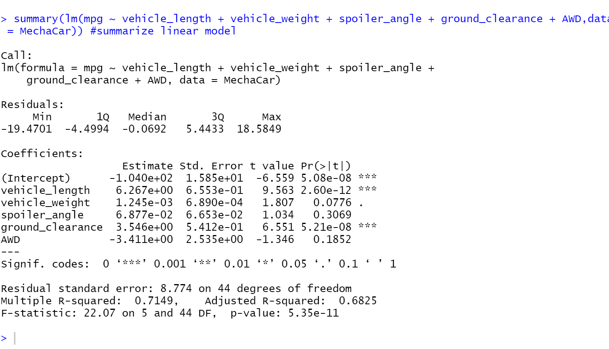
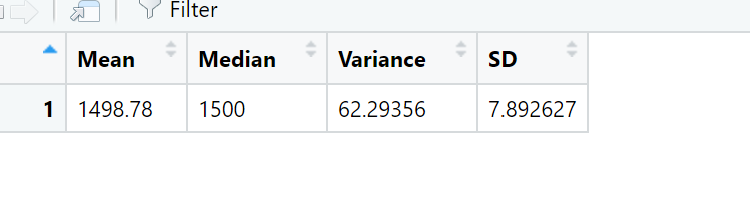
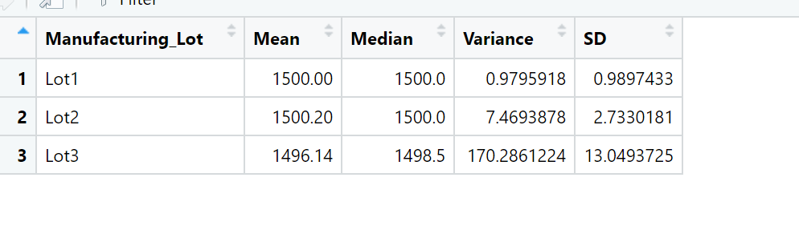
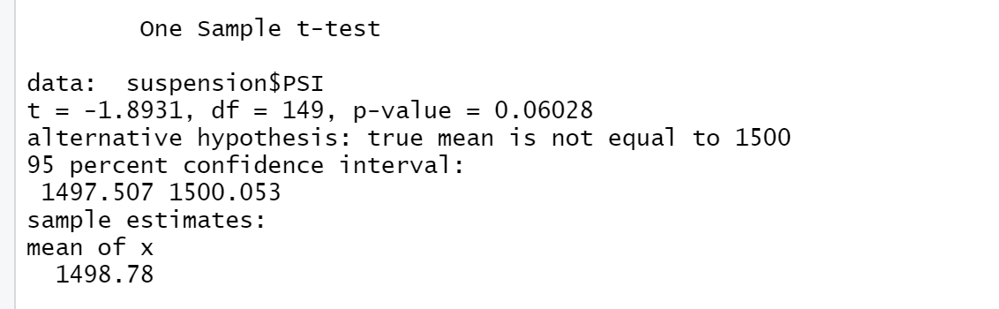
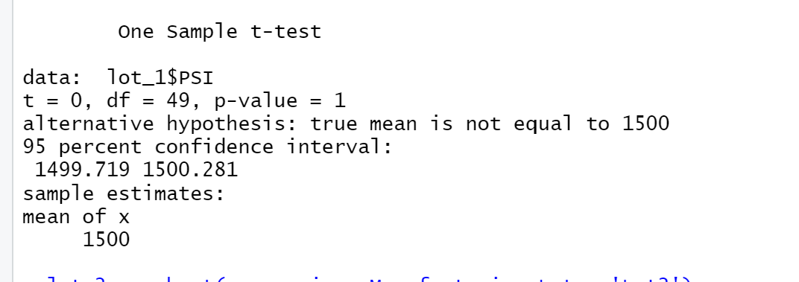
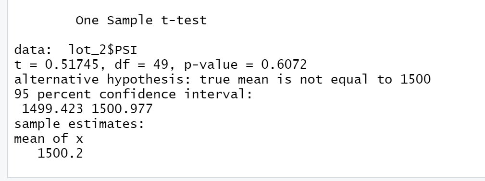
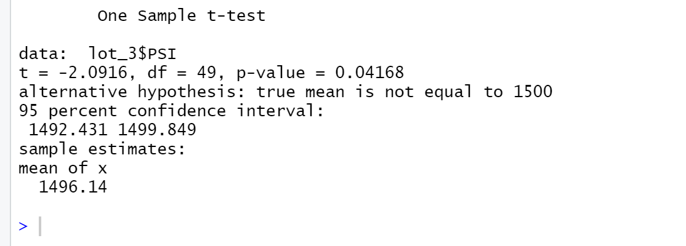

# MechaCar_Statistical_Analysis

Using RScript for statistical analysis: linear regression & t-test.

## Linear Regression to Predict MPG

### The output from the linear regression:

   

 - Answers to the following questions:

   1. Which variables/coefficients provided a non-random amount of variance to the mpg values in the dataset?
   
      The variables/coefficients provided a non-random amount of variance to the mpg values in the dataset are ground clearance, vehicle length, and Intercept. Their p values are 5.21e-08, 2.60e-12, and 5.08e-08, respectively. These values are less than our assumed significance level of 0.05. The smaller the p value the less likelyhood that the data being affected by random chances. 
   
   2. Is the slope of the linear model considered to be zero? Why or why not?
   
      The slope is not zero, because the p-value of our linear regression analysis is 5.35e-11, which is much smaller than our assumed significance level of 0.05%. Therefore, we can state that there is sufficient evidence to reject our null hypothesis, which means that the slope of our linear model is not zero.
  
   3. Does this linear model predict mpg of MechaCar prototypes effectively? Why or why not?
 
      Since the p value is 5.35e-11, which mean the propbability of being wrong is extremely low, statistically unlikely to provide random amount of variance; and the r value is 0.7149, which mean there is a strong positive correllation between our variables.  Therefore, we anticipate that the linear model will perform well.

## Statistics on Suspension Coils

### Output of the summary statistics 

 - total_summary dataframe

   
  
 - lot_summary dataframe

   
  
 - Address the following question:

The design specifications for the MechaCar suspension coils dictate that the variance of the suspension coils must not exceed 100 pounds per square inch. Does the current manufacturing data meet this design specification for all manufacturing lots in total and each lot individually? Why or why not?

The variance of the total manufacturing lots was 62.29356. This is less than the limit of 100 pounds.  Therefore, it met the design specifications.
However, in the individually lot summary table it showed that lot 3 fail to meet the design specification.  Lot 3 variance was 170.286 which was larger than 100 pounds limit.  lot 1 and lot 2 met the specification. Their variance was 0.097 and 7.469 respectively.

## T-Tests on Suspension Coils

### outputs of the t-test 

 - All lots
 

 - Lot 1 
 

 - Lot2
 

 - Lot 3
 

 - Answer to the following question:
 
   Determine if all manufacturing lots and each lot individually are statistically different from the population mean of 1,500 pounds per square inch.
  
  - Results are:
   1. p-value across all manufacturing was 0.06028. This is greater than 0.05 our assumed statistically different level.  Therefore it is not statistically different.
   2. lot 1 p-value was 1.0. This is greater than 0.05 our assumed statistically different level.  Therefore it is not statistically different.
   3. lot 2 p-value was 0.6072.  This is greater than 0.05 our assumed statistically different level.  Therefore it is not statistically different.
   4. lot 3 p-value was 0.04168. This is less than 0.05 our assumed statistically different level. However, the difference between 0.04168 and 0.05 is small. Therefore it is statistically inconclusive. 
  
## Study Design: MechaCar vs Competition.

Write a short description of a statistical study that can quantify how the MechaCar performs against the competition. In your study design, think critically about what metrics would be of interest to a consumer: for a few examples, cost, city or highway fuel efficiency, horse power, maintenance cost, or safety rating.
In your description, address the following questions:
What metric or metrics are you going to test?
What is the null hypothesis or alternative hypothesis?
What statistical test would you use to test the hypothesis? And why?
What data is needed to run the statistical test?

My study design would be to compare the city and highway fuel efficiency of MechaCar vs Compettion.
horse power and miles per gallon (mpg) in city and highway
I'll be using multi-linear regression test
my null hypothesis is 

